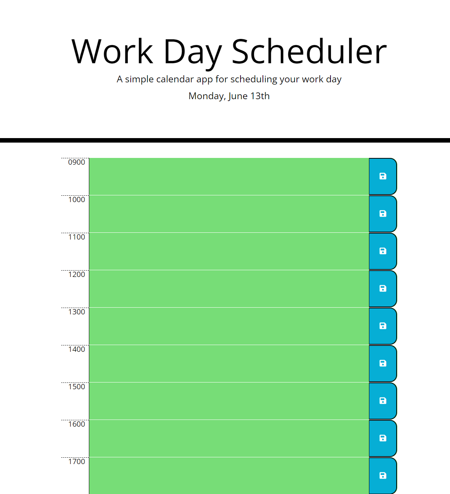

# Work Day Scheduler Starter Code
This is a program made to keep track of tasks and your agenda for the day. 

## Languages
*HTML  
*CSS
*JavaScript
*BootStrap
*jQuery

## image

## Webpage
https://github.com/bfranks3/work-day-scheduler.git